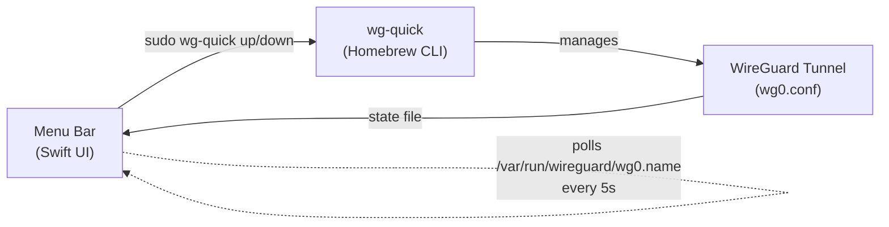

# wireguard-lite

Minimal macOS menu-bar app to toggle WireGuard VPN connections. A lightweight, open-source alternative to the official App Store client — built with Swift, no Xcode project required.

## How It Works



- Wraps `wg-quick` from Homebrew — zero extra dependencies
- Detects external state changes (e.g., toggled from terminal)
- Menu-bar only — no Dock icon
- Supports passwordless sudo for seamless toggling
- Universal binary (Apple Silicon + Intel)

## Prerequisites

```bash
brew install wireguard-tools
```

Place your config at the standard Homebrew path. The app auto-detects:
- `/opt/homebrew/etc/wireguard/wg0.conf` (Apple Silicon)
- `/usr/local/etc/wireguard/wg0.conf` (Intel)
- `/etc/wireguard/wg0.conf` (system)

## Build & Install

```bash
# Build universal binary (arm64 + x86_64)
make

# Install to /Applications
make install

# Recommended: enable passwordless sudo for wg-quick
make setup

# Optional: auto-launch on login
make autostart
```

## Uninstall

```bash
make noautostart   # remove auto-start (if enabled)
make unsetup       # remove sudoers rule (if enabled)
make uninstall     # remove from /Applications
```

## Stack

| Component | Detail |
|---|---|
| Language | Swift 5 |
| Framework | Cocoa (native macOS) |
| Build | Makefile + swiftc (no Xcode project needed) |
| Binary | Universal (arm64 + x86_64) |
| Target | macOS 12.0+ |
| Dependency | `wireguard-tools` via Homebrew |

## License

MIT
